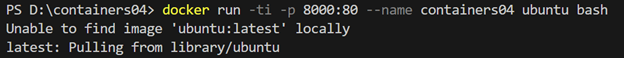

### Lucrare de laborator Nr4: 
Utilizarea containerelor ca medii de execuție.

### Scopul lucrării de laborator:
Familiarizarea cu comenzile de bază ale OS Debian/Ubuntu și comenzi de bază din Docker.

### Sarcina lucrării:
Pornind de la imaginea oficială a sistemului de operare Ubuntu, să se creeze un container care să conțină un server web Apache. Să se creeze o pagină web care să conțină textul "Hello, World!" și să se afișeze într-un browser.

### Executarea lucrării:
1) Am creat un nou director de lucru cu numele container04.
2) Am pornit aplicația Docker Desktop pentru a porni Docker engine-ul.
3) Din terminal am executat următoarea comandă:
   ```
   docker run -ti -p 8000:80 --name containers04 ubuntu bash
   ```
   docker run - creează și rulează un container.
   -ti - pornește un terminal interactiv (-t pentru alocarea unui pseudo-TTY și -i pentru intrare interactivă).
   -p 8000:80 - mapează portul 80 din container pe portul 8000 al hostului.
   --name containers04 - setează ca numele containerului să fie containers04.
   ubuntu - utilizează imaginea Ubuntu ca bază pentru container.
   bash - deschide un shell Bash interactiv.
   
4) În terminalul deschis am executat următoarele comenzi:
   ```
   apt update
   apt install apache2 -y
   service apache2 start
   ```
   apt update - actualizează lista de pachete disponibile.
   apt install apache2 - instalează serverul web Apache2 (-y acceptă automat toate confirmările).
   service apache2 start - pornește serviciul Apache2, astfel încât serverul web să înceapă să ruleze pagini pe portul 80 al containerului.
5) Acum că am pornit serviciul Apache2 și intrăm pe http://localhost:8000, vedem următoarea pagină web:
   
6) În terminalul interactiv am executat următoarele comenzi:
   ```
   ls -l /var/www/html/
   echo '<h1>Hello, World!</h1>' > /var/www/html/index.html
   ```
   ls -l /var/www/html/ - Afișează pe lung (-l) conținutul directorului /var/www/html/.
   echo ```'<h1>Hello, World!</h1>'``` > /var/www/html/index.html - suprascrie conținutul fișierului index.html (fișier care am văzut că există cu comanda precedentă) cu un tag h1 ce conține "Hello, world".

   
   
7) După ce am făcut refresh la pagina web, ea s-a schimbat în următoarea pagină:
   
   
   
   Pe pagină se află doar scrisul "Hello, world".
8) Pe urmă, am executat comenzile:
   ```
   cd /etc/apache2/sites-enabled/
   cat 000-default.conf
   ```
   cd /etc/apache2/sites-enabled/ - schimbă directorul curent cu directorul /etc/apache2/sites-enabled/.
   cat 000-default.conf - afișează conținutul fișierului 000-default.conf.
   
   
   
   În fișier se află informații despre configurarea site-ului pe portul 80 al containerului.
9) Am executat comanda "exit" pentru a ieși din terminalul interactiv.
10) Am afișat lista de containere cu următoarea comandă (atât cele pornite, cât și cele oprite):
    ```
    docker ps -a
    ```
    
11) Am șters containerul containers04 cu comanda:
    ```
    docker rm containers04
    ```

### Concluzii:
Am învățat cum să creez un container care mapează portul gazdei cu portul containerului. Astfel, când am adăugat ceva in conținutul fișierului index.html din container, și am instalat și pornit serviciul Apache2, am văzut pe browser-ul din gazdă conținutul site-ului din container. De asemenea, am văzut că doar pornind serviciul Apache2 putem vedea conținut pe pagina web. Datorită opțiunilor -ti la comanda docker run, am putut scrie toate comenzile pentru container în același terminal (doar că se pornește un terminal special).
   
